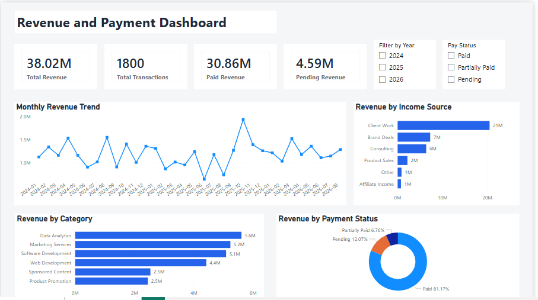
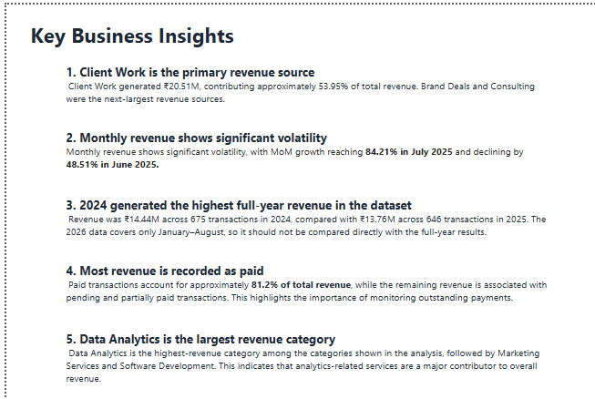

# Revenue & Payment Analytics Dashboard

An end-to-end data analytics project that analyzes transaction data to understand revenue performance, income sources, payment status, categories, and transaction trends.

The project uses Python for data preparation, SQL for business analysis, and Power BI for interactive visualization and reporting.

---

## Dashboard Preview

### Revenue Overview



### Business Insights



---

## Project Objective

The objective of this project is to transform transaction-level data into meaningful business insights.

The analysis focuses on:

- Revenue performance
- Transaction volume
- Monthly revenue trends
- Month-over-month growth
- Income-source contribution
- Category performance
- Payment status
- Payment methods
- Client/product performance
- Yearly performance

---

## Tools & Technologies

- **Python**
- **Pandas**
- **SQL**
- **SQLite**
- **Power BI**
- **DAX**
- **GitHub**

---

## Project Workflow

```text
Raw Transaction Data
        ↓
Python / Pandas
        ↓
Data Cleaning & Validation
        ↓
Database Creation
        ↓
SQL Business Analysis
        ↓
Power BI Data Modeling
        ↓
DAX Measures
        ↓
Interactive Dashboard
        ↓
Business Insights
